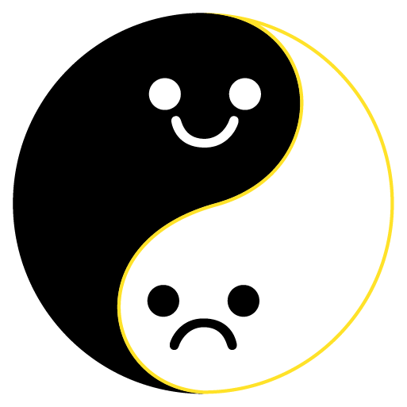
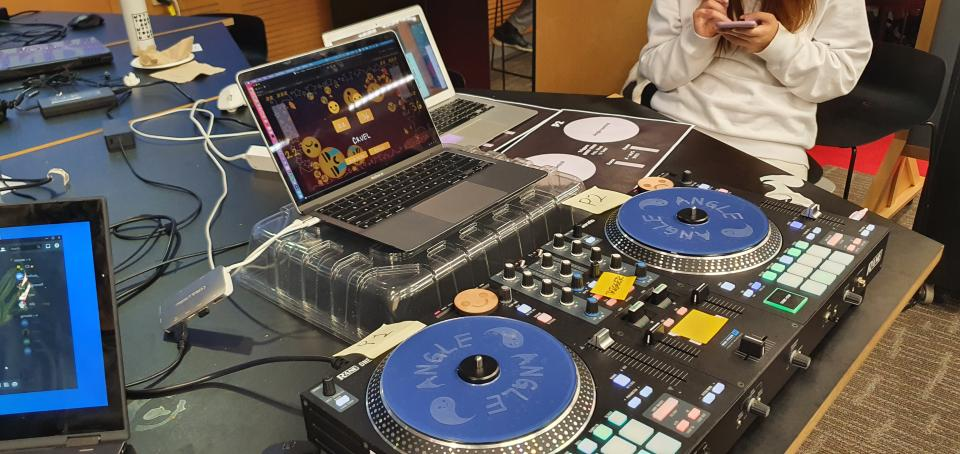

<h1 align="center">
    </img>    
     
    Emosion
     
</h1>
<h4 align="center">Adapt your emotions to the current mood and feel better through self-realization</h4>

---

### Genre:

Turn-based multiplayer zen-arcade created in Unity

Goal: Adapt your emotions to the current mood and feel better through self-realisation!

Gameplay: Get points for collecting emojis of your mood, by growing them on the screen (and in yourself)

### Features:

A weird mix of zen-game and fast chess
Start your day from a round of Emosion (then coffee) and beat your opponent in a friendly battle for emotions.
Shooting mechanic in a zen-game. Try that!
2-mins session of concentrated emotions
Being angry is ok if you control your emotions
Highly addictive.
Can be even tactical

### Music by:

Revolution Void (Someone Else's Memories)
Daedelus (Make It Drums)

### MIDI Controller

